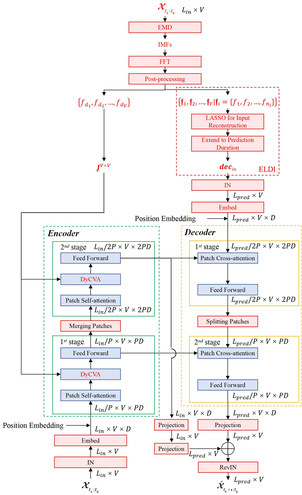

# Variable-Dynamic Multivariate Time Series Forecasting for IoT Systems


This is the original Pytorch implementation of VDformer in the following paper: 
[Variable-Dynamic Multivariate Time Series Forecasting for IoT Systems] (Manuscript submitted to IEEE IOTJ).

## Model Architecture
The past decade has witnessed the success of deep learning-based multivariate time series forecasting in Internet of Things (IoT) systems. However, dynamic variable correlation remains a long-standing problem. The majority of existing multivariate forecasting methods either constantly forbid the interactions of all variables or, conversely, keep extracting the correlations of all variables, which is suboptimal for real-world time series with time-varying variable correlations. In contrast, we introduce a novel variable-dynamic forecasting transformer named VDformer. By leveraging empirical mode decomposition (EMD), VDformer can sparsely identify the dominant periodic ingredients of each variable in an arbitrary multivariate sequence via Fourier spectral analysis of its intrinsic mode functions (IMFs) obtained by the EMD. Thus, a mask matrix, where only the variables with identical dominant periodic ingredients are allowed for interactions, can be generated and used in the cross-variable attention modules of VDformer to dynamically gauge and extract the variable correlations. Additionally, better decoder initialization can be obtained by reconstructing the input sequence with these dominant periodic ingredients and extending the reconstructed results to the prediction duration. Extensive experiments on 11 benchmarks, which cover five IoT-related domains, demonstrate the state-of-the-art forecasting performance of VDformer (10.02\% MSE reduction relative to the current best method). The architecture of VDformer is shown in Figure 1.

<p align="center">

<br><br>
<b>Figure 1.</b> The architecture of VDformer.
</p>


## Requirements

- python == 3.11.4
- numpy == 1.24.3
- pandas == 1.5.3
- scipy == 1.11.3
- scikit_learn == 0.24.1
- torch == 2.1.0+cu118
- EMD-signal == 1.5.2


Dependencies can be installed using the following command:
```bash
pip install -r requirements.txt
```

## Data

ETT, ECL, Traffic and Weather dataset were acquired at: [here](https://drive.google.com/drive/folders/1ZOYpTUa82_jCcxIdTmyr0LXQfvaM9vIy?usp=sharing). Solar dataset was acquired at: [Solar](https://drive.google.com/drive/folders/1Gv1MXjLo5bLGep4bsqDyaNMI2oQC9GH2?usp=sharing). The raw data of Air dataset was acquired at: [Air](https://archive.ics.uci.edu/dataset/360/air+quality). The raw data of River dataset was acquired at: [River](https://www.kaggle.com/datasets/samanemami/river-flowrf2). The raw data of HomeC dataset was acquired at: [Air](https://archive.ics.uci.edu/dataset/360/air+quality).
### Data Preparation
After you acquire raw data of all datasets, please separately place them in corresponding folders at `./FPPformerV2/data`. 

We place ETT in the folder `./ETT-data`, ECL in the folder `./electricity`  and weather in the folder `./weather` of [here](https://drive.google.com/drive/folders/1ZOYpTUa82_jCcxIdTmyr0LXQfvaM9vIy?usp=sharing) (the folder tree in the link is shown as below) into folder `./data` and rename them from `./ETT-data`,`./electricity`, `./traffic` and `./weather` to `./ETT`, `./ECL`, `./Traffic` and`./weather` respectively. We rename the file of ECL/Traffic from `electricity.csv`/`traffic.csv` to `ECL.csv`/`Traffic.csv` and rename its last variable from `OT`/`OT` to original `MT_321`/`Sensor_861` separately.

```
The folder tree in https://drive.google.com/drive/folders/1ZOYpTUa82_jCcxIdTmyr0LXQfvaM9vIy?usp=sharing:
|-autoformer
| |-ETT-data
| | |-ETTh1.csv
| | |-ETTh2.csv
| | |-ETTm1.csv
| | |-ETTm2.csv
| |
| |-electricity
| | |-electricity.csv
| |
| |-traffic
| | |-traffic.csv
| |
| |-weather
| | |-weather.csv
```

To standardize the data format, we convert the data file of [Solar](https://drive.google.com/drive/folders/1Gv1MXjLo5bLGep4bsqDyaNMI2oQC9GH2?usp=sharing) from 'solar_AL.txt' to 'solar_AL.csv'. Then we compress this file and upload it to the folder `./data/Solar`, where you can get the data file by simply unzipping the 'solar_AL.zip' file.

We preprocess Air/River in [Air](https://archive.ics.uci.edu/dataset/360/air+quality) /[River](https://www.kaggle.com/datasets/samanemami/river-flowrf2) /[BTC](https://www.kaggle.com/datasets/prasoonkottarathil/btcinusd) /[ETH](https://www.kaggle.com/datasets/franoisgeorgesjulien/crypto) (the folder tree in the link is shown as below) and put the data files into the folder `./data/Air`/`./data/River` respectively. 

```
The folder tree in https://archive.ics.uci.edu/dataset/360/air+quality:
|-air+quality
| |-AirQualityUCI.csv
| |-AirQualityUCI.xlsx

The folder tree in https://www.kaggle.com/datasets/samanemami/river-flowrf2:
|-river-flowrf2
| |-RF2.csv
```
The data of HomeC is sampled so that the interval is 15 minutes to align with the settings of other minute-level datasets. You can find the preprocessed dataset at `.data/HomeC/HomeC.csv`.

After you finish the above operations, you will obtain the folder tree below:
```
|-data
| |-Air
| | |-Air.csv
| |
| |-ECL
| | |-ECL.csv
| |
| |-ETT
| | |-ETTh1.csv
| | |-ETTh2.csv
| | |-ETTm1.csv
| | |-ETTm2.csv
| |
| |-River
| | |-River.csv
| |
| |-Solar
| | |-solar_AL.txt
| |
| |-Traffic
| | |-Traffic.csv
| |
| |-weather
| | |-weather.csv
| |
| |-HomeC
| | |-HomeC.csv

```

## Usage
Commands for training and testing VDformer of all datasets are in `./scripts/Main.sh`.

More parameter information please refer to `main.py`.

We provide a complete command for training and testing VDformer:

```
python -u main.py --data <data> --features <features> --input_len <input_len> --pred_len <pred_len> --encoder_layer <encoder_layer> --patch_size <patch_size> --d_model <d_model> --learning_rate <learning_rate> --dropout <dropout> --batch_size <batch_size> --train_epochs <train_epochs> --patience <patience> --itr <itr> --train --EMD <EMD>
```


Here we provide a more detailed and complete command description for training and testing the model:

| Parameter name |Description of parameter|
|:--------------:|:----------------------------------------------------------------------------------------------------------:|
|      data      | The dataset name |
|   root_path    |The root path of the data file|
|   data_path    |The data file name|
|    features    | The forecasting task. This can be set to `M`,`S` (M : multivariate forecasting, S : univariate forecasting |
|     target     |  Target feature in `S` task  |
|   ori_target   |  Default target, determine the EMD result order  |
|  checkpoints   |Location of model checkpoints |
|   input_len    | Input sequence length  |
|    pred_len    |  Prediction sequence length  |
|     enc_in     |    Input size    |
|    dec_out     |   Output size    |
|    d_model     |Dimension of model|
|    dropout     |     Dropout      |
| encoder_layer  | The number of encoder layers |
|   patch_size   | The size of each patch |
|     Cross      | Whether to use cross-variable attention |
|      EMD       | Whether to use EMD as the prediction initialization |
|      itr       |Experiments times |
|  train_epochs  |  Train epochs of the second stage  |
|   batch_size   |   The batch size of training input data in the second stage|
|    patience    |Early stopping patience |
| learning_rate  |Optimizer learning rate |


## Results
The experiment parameters of each data set are formated in the `Main.sh` and `Univariate_ECL.sh` files in the directory `./scripts/`. You can refer to these parameters for experiments, and you can also adjust the parameters to obtain better MSE and MAE results or draw better prediction figures. 

We provide the results of EMD process in the link [EMD](https://drive.google.com/file/d/1fzG7bz3vYIgsbDIykhn8FrZ88slcfuKO/view?usp=sharing). You can download and place it in corresponding folders at `./FPPformerV2/EMD` to reduce the time consumption.

<p align="center">

<br><br>
<b>Figure 2.</b> Multivariate forecasting results under 1-hour-level datasets
</p>

<p align="center">

<br><br>
<b>Figure 3.</b> Multivariate forecasting results under minute-level datasets
</p>

<p align="center">

<br><br>
<b>Figure 4.</b> Univariate forecasting results
</p>


## Contact
If you have any questions, feel free to contact Li Shen through Email (shenli@buaa.edu.cn) or Github issues. Pull requests are highly welcomed!
